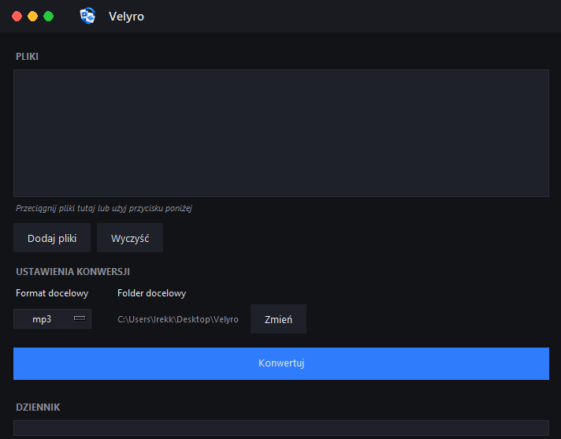

# Velyro

Simple, modern desktop app for converting video, audio, and image files on Windows.


## Features

- Convert video/audio: MP4, MKV, MOV, AVI, WEBM, WMV, FLV, WAV, MP3, OGG, FLAC, AAC, M4A, WMA, OPUS
- Convert images: WEBP, JPG, PNG, BMP, GIF, TIFF, ICO
- Drag and drop files straight into the app
- Fully standalone — no Python, no ffmpeg install, no internet connection required
- Clean dark UI

## Screenshot



## Download

Get the latest version from the [Releases page](https://github.com/xiroxpl/velyro/releases/latest) — download `instalator.exe`, run it, and you're done. It creates a Start Menu entry and a desktop shortcut.

> **Note:** Windows SmartScreen may warn about an unrecognized app since it isn't code-signed. Click **More info → Run anyway** to proceed.

## Building from source

Requirements: Windows, Python 3.10+, [Inno Setup](https://jrsoftware.org/isdl.php) (optional, for the installer).

```bash
pip install -r requirements.txt
build_exe.bat
```

This produces a fully self-contained `dist/Velyro.exe` (ffmpeg is bundled — no runtime downloads). To build the installer, open `instalator.iss` in Inno Setup and hit Build.

## Tech stack

- Python + Tkinter (UI)
- Pillow (image conversion)
- imageio-ffmpeg (video/audio conversion, ffmpeg bundled)
- tkinterdnd2 (drag and drop)
- PyInstaller + Inno Setup (packaging)

## License

MIT — see [LICENSE](LICENSE).
